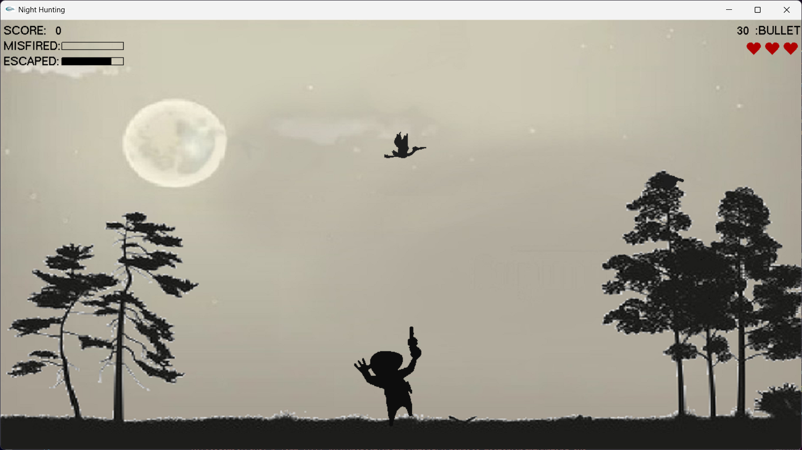
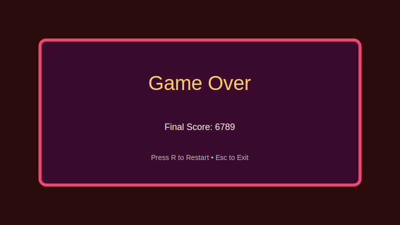

# IGraphics 🎮✨

**IGraphics** is a lightweight, easy-to-use 2D graphics wrapper on top of OpenGL designed for quick demos and small C/C++ game projects. This repository contains a sample game **NightHunting** that demonstrates how to use the library for animation, input handling, simple sound, and sprite drawing.

---

## 🔥 Highlights

- **Lightweight** and minimal API — ideal for teaching and small student projects
- **Simple animation & timer API** for periodic updates
- **Immediate-mode 2D drawing** (lines, circles, rectangles, polygons)
- **Keyboard & mouse I/O** and **text rendering** helpers
- Includes a working **NightHunting** demo game and a Ball demo

---

## 🚀 Quick Start

1. Build the demo (example using MinGW/g++):

```bash
# Compile
g++ -IOpenGL\include -w -c NightHunting.cpp -o NightHunting.o

# Link (note: -lwinmm is required for PlaySound)
g++ -LOpenGL\lib NightHunting.o -o NightHunting.exe -lGlaux -lGLU32 -lglui32 -lglut32 -lOPENGL32 -lgdi32 -lwinmm
```

2. Run:

- Put `glut32.dll` (or a compatible `freeglut` DLL) next to `NightHunting.exe` and then run:

```bash
NightHunting.exe
```

> ⚠️ Common issues: If the program fails to start, check that the DLLs (`glut32.dll`, `glui32.dll`, etc.) are present and that their architecture (32 vs 64-bit) matches your compiler.

---

## 🧩 Features

- Animation timers: `iSetTimer`, `iPauseTimer`, `iResumeTimer`
- Drawing primitives: points, lines, rectangles, filled shapes, circles, ellipses
- Text rendering: `iText(x, y, char *str, void* font=GLUT_BITMAP_8_BY_13)`
- Window management: `iInitialize(width, height, title)`
- Input callbacks: `iKeyboard`, `iSpecialKeyboard`, `iMouseMove`, `iMouse`

---

## 📷 Screenshots

Here are placeholder images showing the different stages of the demo. Replace these placeholders with actual screenshots (`PNG`/`JPEG`) to make the README more attractive.

- **Menu**


- **Playing**



- **Game Over**



---

## 🎯 Controls (example)

- Arrow keys: Move/aim
- Space: Fire
- P: Pause / Resume
- R: Restart
- Esc: Exit

_(Verify in `NightHunting.cpp` for exact controls; these are common defaults.)_

---

## 🛠 Troubleshooting & Notes

- Linker error `undefined reference to PlaySoundA@12` → add `-lwinmm` to the link command (already included in examples above).
- Missing `glut32.dll` → download a compatible GLUT or FreeGLUT package and put `glut32.dll` next to the executable. Ensure 32/64-bit matches.
- For dependency inspection on Windows, tools like **Dependency Walker** or `objdump -p` can help locate missing DLLs.

---

## 📚 API Reference (subset)

- `int iSetTimer(int msec, void (*f)(void))`
- `void iPauseTimer(int index)`
- `void iResumeTimer(int index)`
- `void iSetColor(double r, double g, double b)`
- `void iPoint(double x, double y, int size=0)`
- `void iLine(double x1, double y1, double x2, double y2)`
- `void iFilledPolygon(double x[], double y[], int n)`
- `void iRectangle(double left, double bottom, double dx, double dy)`
- `void iFilledCircle(double x, double y, double r, int slices=100)`
- `void iText(double x, double y, char *str, void* font=GLUT_BITMAP_8_BY_13)`
- `void iInitialize(int width=500, int height=500, char *title="iGraphics")`

---

## 🤝 Contributing

Contributions are welcome — open a PR with bug fixes, documentation improvements, or more demo scenes. Please include:

- A short description of your change
- Screenshots for visual changes
- Build instructions if any new dependency is introduced

---

## 📄 License

This project is licensed under the **MIT License** — see the [LICENSE](LICENSE) file for the full license text.

Copyright (c) 2022 Afzal Hossan

---

## ✉️ Contact

For questions or help, open an issue or contact with me.
